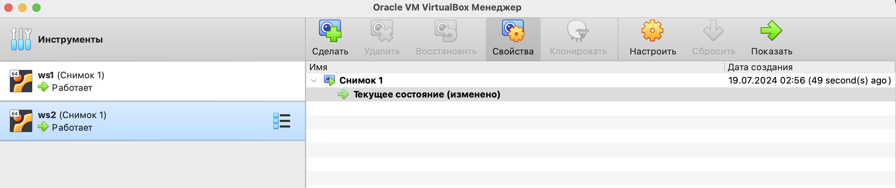
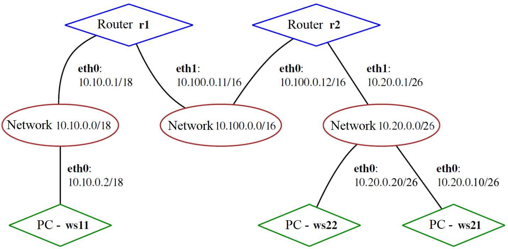
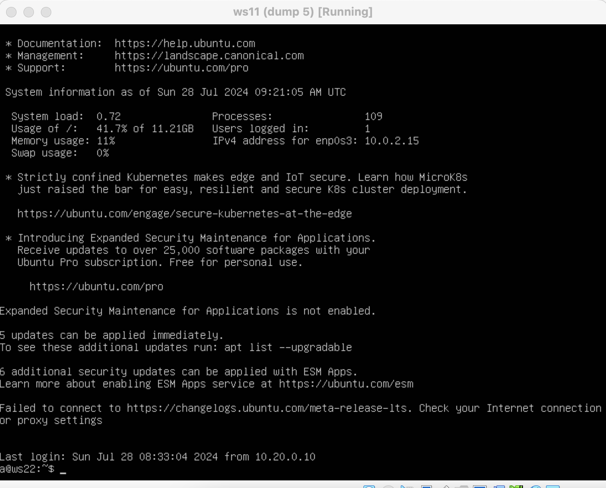

# Отчет по выполнению заданий

## 1. Инструмент ipcalc `sudo apt install ipcalc`

ipcalc - Калькулятор для расчета адресов в подсети и сетевых масок.

### 1.1 Сети и маски

1. Адрес сети `192.167.38.54/13`

Возможно расчитать математически
  IP-адрес `192.167.38.54`:

  192 -> `11000000`
  167 -> `10100111`
  38 -> `00100110`
  54 -> `00110110`
  `11000000.10100111.00100110.00110110`
  Маска /13 означает, что первые 13 битов установлены в 1, а остальные в 0:
    `11111111.11111000.00000000.00000000`
  IP-адрес: `11000000.10100111.00100110.00110110`
  Маска:    `11111111.11111000.00000000.00000000`
  Результат:`11000000.10100000.00000000.00000000`
  
  Разделим на октеты и преобразуем каждый обратно в десятичный формат:

  11000000 -> 192
  10100000 -> 160
  00000000 -> 0
  00000000 -> 0
  Адрес сети: `192.160.0.0`

   - Адрес сети: `192.160.0.0/13`


2. Перевод масок
   - Маска `255.255.255.0`:
     - Префиксная запись: /24
     - Двоичная запись: `11111111.11111111.11111111.00000000`


   - Маска /15:
     - Обычная запись: `255.254.0.0`
     - Двоичная запись: `11111111.11111110.00000000.00000000`


   - Маска `11111111.11111111.11111111.11110000`:
      11111111 -> 255
      11111111 -> 255
      11111111 -> 255
      11111111 -> 240
     - Обычная запись: `255.255.255.240`
     - Префиксная запись: /28


3. Минимальный и максимальный хост в сети `12.167.38.4` при масках:
   - Маска /8:
     - Минимальный хост: `12.0.0.1`
     - Максимальный хост: `12.255.255.254`

     

   - Маска `11111111.11111111.00000000.00000000` (/16):
      `11111111.11111111.00000000.00000000` = `255.255.0.0`
     - Минимальный хост: `12.167.0.1`
     - Максимальный хост: `12.167.255.254`


   - Маска `255.255.254.0` (/23):
     - Минимальный хост: `12.167.38.1`
     - Максимальный хост: `12.167.39.254`


   - Маска /4:
     - Минимальный хост: `0.0.0.1`
     - Максимальный хост: `15.255.255.254`


### 1.2 localhost

Можно ли обратиться к приложению, работающему на localhost, со следующих IP:
`localhost` это адрес принадлежит к специальному диапазону адресов, который называется loopback.

Loopback адреса включают диапазон от `127.0.0.0` до `127.255.255.255`. Все адреса в этом диапазоне считаются локальными и используются для взаимодействия программ на одной и той же машине.
localhost, подразумевается использование адресов сети loopback, которая традиционно использует диапазон адресов `127.0.0.0/8`.

- `194.34.23.100`: Нет
- `127.0.0.2`: Да
- `127.1.0.1`: Да
- `128.0.0.1`: Нет

### 1.3 Диапазоны и сегменты сетей

Частные IP-адреса определены в трех диапазонах:

```
10.0.0.0 - 10.255.255.255 (Class A)
172.16.0.0 - 172.31.255.255 (Class B)
192.168.0.0 - 192.168.255.255 (Class C)
```
Эти диапазоны не маршрутизируются в интернете и используются для локальных сетей.

IP-адреса, не входящие в эти диапазоны, являются публичными и могут использоваться в интернете.

```
1. Публичные и частные IP:
   - 10.0.0.45: Частный
   - 134.43.0.2: Публичный
   - 192.168.4.2: Частный
   - 172.20.250.4: Частный
   - 172.0.2.1: Публичный
   - 192.172.0.1: Публичный
   - 172.68.0.2: Публичный
   - 172.16.255.255: Частный
   - 10.10.10.10: Частный
   - 192.169.168.1: Публичный
```


2. Возможные IP адреса шлюза в сети 10.10.0.0/18:

Для определения возможных IP-адресов шлюза в сети 10.10.0.0/18, необходимо знать, что маска /18 охватывает диапазон от 10.10.0.0 до 10.10.63.255. Маска /18 означает, что первые 18 бит определяют сеть, а оставшиеся 14 бит определяют хосты внутри этой сети.


```
   - 10.0.0.1: Нет
   - 10.10.0.2: Да
   - 10.10.10.10: Да
   - 10.10.100.1: Нет
   - 10.10.1.255: Да
```

## 2. Статическая маршрутизация между двумя машинами

 Преднастройка для соединения между двумя внутренними машинами


### Вызов команды `ip a` на ws1


### Вызов команды `ip a` на ws2


### Настройка сетевых интерфейсов

Содержание файла `/etc/netplan/00-installer-config.yaml` на ws1

```
network:
  ethernets:
    enp0s3:
      dhcp4: true
    enp0s8:
      dhcp4: false
      addresses: [192.168.100.10/16]
  version: 2
```


```
network:
  ethernets:
    enp0s3:
      dhcp4: true
    enp0s8:
      dhcp4: false
      addresses: [172.24.116.8/12]
  version: 2
```


ws1 and ws2 `sudo netplan apply`


### Добавление статического маршрута вручную

Добавление статического маршрута от одной машины до другой и обратно при помощи команды вида ip r add.

Пропингуем соединение между машинами.

ws1 `sudo ip r add 192.168.100.10 dev enp0s3`


ws2 `sudo ip r add 172.24.116.8 dev enp0s3`


ws1 `ping 172.24.116.8`


ws2 `ping 192.168.100.10`


### Добавление статического маршрута с сохранением

`sudo reboot`


Добавь статический маршрут от одной машины до другой с помощью файла /etc/netplan/00-installer-config.yaml.

ws1
```
network:
  ethernets:
    enp0s3:
      dhcp4: true
    enp0s8:
      dhcp4: false
      addresses: [192.168.100.10/16]
      routes:
              - to: 172.24.116.8
              via: 192.168.100.10
  version: 2
```


ws2
```
network:
  ethernets:
    enp0s3:
      dhcp4: true
    enp0s8:
      dhcp4: false
      addresses: [172.24.116.8/12]
      routes:
              - to: 192.168.100.10
              via: 172.24.116.8
  version: 2
```


ws1 and ws2 `sudo netplan apply`


ws1 `ping 172.24.116.8`


ws2 `ping 192.168.100.10`


## 3. Утилита iperf3

iperf3 — программа для измерения пропускной способности сети в реальном времени.

### 3.1. Скорость соединения

Переведи и запиши в отчёт:

```
8 Mbps = 1 MB/s(мегабит/c в мегабайт/c)

100 MB/s = 800000 Kbps(мегабайт/c в килобит/c)

1 Gbps = 1000 Mbps(гигабит/c в мегабит/c)
```

### 3.2 Утилита iperf3 `sudo apt install iperf3`

ws1


ws2


Измерь скорость соединения между ws1 и ws2.

На ws1 `iperf3 -s` - для перехода в режим прослушивания сервера

На ws2 `iperf3 -c 192.168.100.10` - Для отправки пакетов на ws1


## 4. Сетевой экран

### 4.1. Утилита iptables

Создай файл /etc/firewall.sh, имитирующий фаерволл, на ws1 и ws2:

```
#!/bin/sh

# Удаление всех правил в таблице «filter» (по-умолчанию).
iptables -F
iptables -X
```

Нужно добавить в файл подряд следующие правила:

1) На ws1 примени стратегию, когда в начале пишется запрещающее правило, а в конце пишется разрешающее правило (это касается пунктов 4 и 5).

2) На ws2 примени стратегию, когда в начале пишется разрешающее правило, а в конце пишется запрещающее правило (это касается пунктов 4 и 5).

3) Открой на машинах доступ для порта 22 (ssh) и порта 80 (http).

4) Запрети echo reply (машина не должна «пинговаться», т.е. должна быть блокировка на OUTPUT).

5) Разреши echo reply (машина должна «пинговаться»).

ws1
```
#!/bin/sh

# Удаление всех правил в таблице «filter» (по-умолчанию).
iptables -F
iptables -X

# Открываем доступ для порта 22 (ssh) и порта 80 (http)
iptables -A INPUT -p tcp --dport 22 -j ACCEPT
iptables -A INPUT -p tcp --dport 80 -j ACCEPT

# Запретить echo reply (машина не должна пинговаться)
iptables -A OUTPUT -p icmp --icmp-type echo-reply -j DROP

# Разрешить echo reply (машина должна пинговаться)
iptables -A OUTPUT -p icmp --icmp-type echo-reply -j ACCEPT
```

ws2
```
#!/bin/sh

# Удаление всех правил в таблице «filter» (по-умолчанию).
iptables -F
iptables -X

# Открываем доступ для порта 22 (ssh) и порта 80 (http)
iptables -A INPUT -p tcp --dport 22 -j ACCEPT
iptables -A INPUT -p tcp --dport 80 -j ACCEPT

# Разрешить echo reply (машина должна пинговаться)
iptables -A OUTPUT -p icmp --icmp-type echo-reply -j ACCEPT

# Запретить echo reply (машина не должна пинговаться)
iptables -A OUTPUT -p icmp --icmp-type echo-reply -j DROP
```


Запусти файлы на обеих машинах командами:

```
sudo chmod +x /etc/firewall.sh
sudo /etc/firewall.sh
sudo iptables -L
```


Разница в том, что команды выполняются по порядку. Поэтому в ws1 пинг будет запрещен, так как запрещение стоит первее, а в ws2 будет разрешен, так как разрешение стоит первее.

### 4.2. Утилита nmap

Nmap — это инструмент командной строки Linux для исследования сети и проверки безопасности. Особенностью nmap является то, что эта утилита может определить, включен ли хост, даже если его нельзя пропинговать.

Командой ping найди машину, которая не «пингуется», после чего утилитой nmap покажи, что хост машины запущен.

Сначала пробуем пропинговать порт 192.168.100.10 - Не пингуется

Пингуем 172.24.116.8 - Все хорошо

Определяем, что WS1 не пингуется


NMAP на обеих машинах проверил, что машины запущенны


DUMP ws1


DUMP ws2



## 5. Статическая маршрутизация сети

**Сеть:**



### 5.1. Настройка адресов машин

Подними пять виртуальных машин (3 рабочие станции (ws11, ws21, ws22) и 2 роутера (r1, r2)).

Перед дальнейшими манипуляциями, во избежании лишних проблем, заранее обновим систему и установим утилиты для одной виртуальной машины, далее просто клонируйте ее сколько необходимо (r1, r2, ws11, ws21, ws22):

```
sudo apt-get update && sudo apt-get upgrade
sudo apt-get install -y mcedit ipcalc openssh-server apache2 isc-dhcp-server inetutils-traceroute traceroute nmap iptables iperf3
```
Клонируем необходимое количество машин:

 
Настрой конфигурации машин в etc/netplan/00-installer-config.yaml на машинах R1 R2

 
Настрой конфигурации машин в etc/netplan/00-installer-config.yaml на машинах WS11 WS21 WS22


проверяем, что адрес машин задан верно `ip -4 a`

R1 R2


WS11 WS21 WS22


PING WS22 с WS21. PING R1 с WS11.


### 5.2. Включение переадресации IP-адресов

Включаем переадресацию IP, выполняя команду на роутерах(r1, r2): `sudo sysctl -w net.ipv4.ip_forward=1`. При таком подходе переадресация не будет работать после перезагрузки системы.


Открыть файл /etc/sysctl.conf и добавь в него следующую строку:

`net.ipv4.ip_forward = 1`

При использовании этого подхода, IP-переадресация включена на постоянной основе.


### 5.3. Установка маршрута по-умолчанию

Настроика маршрута по-умолчанию (шлюз) для рабочих станций ws11, ws22, ws21:


Вызовим `ip r`, видим добавился маршрут в таблицу маршрутизации.

Пример вывода команды `ip r` после добавления шлюза:
```
default via 10.10.0.1 dev enp0s8
10.10.0.0/18 dev enp0s8 proto kernel scope link src 10.10.0.2
```


Пропингем с ws11 роутер r2 и покажим на r2, что пинг доходит. Для этого используем команду на r2 `tcpdump -tn -i enp0s8`


Не смотря на то, что ping говорить о том, что пакеты потеряны, мы видим на R2 что обращение к нему дошло

### 5.4. Добавление статических маршрутов

Добавим в роутеры r1 и r2 статические маршруты в файле конфигураций. 

Пример для r1 маршрута в сетку 10.20.0.0/26:

```
- to: 10.20.0.0
  via: 10.100.0.12
```


Вызови ip r и покажи таблицы с маршрутами на обоих роутерах. 

Пример таблицы на r1:

```
10.100.0.0/16 dev eth1 proto kernel scope link src 10.100.0.11
10.20.0.0/26 via 10.100.0.12 dev eth1
10.10.0.0/18 dev enp0s8 proto kernel scope link src 10.10.0.1
```


Запусим команды на ws11 `ip r list 10.10.0.0/[маска сети]` и `ip r list 0.0.0.0/0`


* Для адреса 10.10.0.0/[маска сети] был выбран маршрут, отличный от 0.0.0.0/0, потому что маска /18 описывает маршрут к сети точнее, в отличие от маски /0.

Специфичность маршрута: В таблице маршрутизации, если пакет может быть отправлен по нескольким маршрутам, выбирается самый специфичный маршрут. Маршрут к сети 10.10.0.0/18 более специфичен, чем маршрут по-умолчанию (0.0.0.0/0), так как он охватывает только определенную подсеть 10.10.0.0/18.

Приоритетность: Специфичные маршруты имеют более высокий приоритет по сравнению с общими маршрутами. Это означает, что маршрут к 10.10.0.0/18 будет использоваться для трафика, предназначенного для этой сети, даже если существует маршрут по-умолчанию.

### 5.5. Построение списка маршрутизаторов

Пример вывода утилиты `traceroute` после добавления шлюза:
```
1 10.10.0.1 0 ms 1 ms 0 ms
2 10.100.0.12 1 ms 0 ms 1 ms
3 10.20.0.10 12 ms 1 ms 3 ms
```

Запустим на r1 команду дампа `tcpdump -tnv -i enp0s8`

При помощи утилиты traceroute построим список маршрутизаторов на пути от ws11 до ws21.


`traceroute` использует ICMP Echo Request или UDP пакеты для определения маршрута к целевому узлу. Принцип его работы основан на изменении значения поля TTL (Time To Live) в заголовке IP-пакета:

1. **Начальное значение TTL**: Отправляется пакет с TTL («время жизни») равным 1. Первый маршрутизатор на пути к цели уменьшает TTL на 1, что приводит к его обнулению. Маршрутизатор отклоняет пакет и отправляет обратно ICMP сообщение "Time Exceeded".

2. **Увеличение TTL**: `traceroute` затем увеличивает TTL на 1 и повторяет процесс. Второй маршрутизатор обрабатывает пакет аналогичным образом. Этот процесс повторяется, пока пакет не достигнет целевого узла.

3. **ICMP Echo Reply**: Когда пакет достигает целевого узла, целевой узел отвечает ICMP сообщением "Echo Reply", указывая, что пакет достиг своей цели.

На основании вывода `tcpdump` на r1, видно, что каждый маршрутизатор последовательно отвечает на пакеты `traceroute`, предоставляя информацию о своем IP-адресе и времени задержки (RTT).

### 5.6. Использование протокола ICMP при маршрутизации

Запустим на r1 перехват сетевого трафика, проходящего через enp0s8 с помощью команды `tcpdump -n -i enp0s8 icmp`

Пропингуй с ws11 несуществующий IP (например, 10.30.0.111) с помощью команды:
`ping -c 1 10.30.0.111`


Сохраним дампы образов виртуальных машин.


## Part 6. Динамическая настройка IP с помощью DHCP

DHCP — протокол прикладного уровня модели TCP/IP, служит для назначения IP-адреса клиенту.

Для r2 настрой в файле `/etc/dhcp/dhcpd.conf` конфигурацию службы DHCP:

### 1) Укажи адрес маршрутизатора по-умолчанию, DNS-сервер и адрес внутренней сети. Пример файла для r2:

```
subnet 10.100.0.0 netmask 255.255.0.0 {}

subnet 10.20.0.0 netmask 255.255.255.192
{
    range 10.20.0.2 10.20.0.50;
    option routers 10.20.0.1;
    option domain-name-servers 10.20.0.1;
}
```


### 2) В файле resolv.conf пропиши `nameserver 8.8.8.8`.


* Перезагрузи службу DHCP командой systemctl restart isc-dhcp-server. 

* Машину ws21 перезагрузим при помощи `reboot` и через `ip a` покажем, что она получила адрес. Также пропингуй ws22 с ws21.


ping ws22 c ws21


* Укажи MAC адрес у ws11, для этого в etc/netplan/00-installer-config.yaml надо добавить строки: `macaddress: 10:10:10:10:10:BA`, `dhcp4: true`.


Для r1 настроим аналогично r2, но сделаем выдачу адресов с жесткой привязкой к MAC-адресу (ws11). Проведем аналогичные тесты.

1) Укажем адрес маршрутизатора по-умолчанию, DNS-сервер и адрес внутренней сети. Пример файла для r1:

```
subnet 10.100.0.0 netmask 255.255.255.192 {}

subnet 10.20.0.0 netmask 255.255.255.192
{
    range 10.20.0.2 10.20.0.50;
    option routers 10.20.0.1;
    option domain-name-servers 10.20.0.1;
    host ws11
    {
    gardware ethernet 10:10:10:10:10:BA;
    fixed-address 10.10.0.50;
    }
}
```


2) В файле resolv.conf пропишим `nameserver 8.8.8.8`.


Перезагрузить службу DHCP командой `systemctl restart isc-dhcp-server`. Машину ws11 перезагрузить при помощи reboot и через `ip a` показать, что она получила адрес.


Запроси с ws21 ip адрес **ДО**.


Для отображения IP-адреса интерфейса enp0s8 можно использовать команду `ip addr show enp0s8`. Она покажет информацию о сетевом интерфейсе enp0s8, включая его IP-адрес. Если IP-адрес на интерфейсе не настроен, команда вернет пустой вывод для этого интерфейса.

`sudo dhclient -r enp0s8` - для обновления IP-адреса интерфейса с помощью команды dhclient можно использовать флаг -r, который предназначен для освобождения текущего IP-адреса и запуска процесса запроса нового адреса у DHCP-сервера. 

После этого можно запустить команду `dhclient` без каких-либо дополнительных флагов для получения нового IP-адреса от DHCP-сервера.

Запросить с ws21 обновление ip адреса **После**.


### Опции DHCP сервера, использованные в данном пункте:

- `range`: диапазон выдаваемых IP-адресов.
- `option routers`: адрес маршрутизатора по умолчанию.
- `option domain-name-servers`: адрес DNS-сервера.
- `host`: привязка IP-адреса к MAC-адресу.

Сохрани дампы образов виртуальных машин.


## 7. NAT

В данном задании используются виртуальные машины из Части 5.


В файле `/etc/apache2/ports.conf` на ws22 и r1 измени строку `Listen 80` на `Listen 0.0.0.0:80`, то есть сделай сервер Apache2 общедоступным.


Запусти веб-сервер Apache командой `service apache2 start` на ws22 и r1.
Для наглядности `service apache2 start`


ping r1 - w22 до подключения фаервола


Добавь в фаервол, созданный по аналогии с фаерволом из Части 4, на r2 следующие правила:

1) Удаление правил в таблице filter - iptables -F;

2) Удаление правил в таблице "NAT" - iptables -F -t nat;

3) Отбрасывать все маршрутизируемые пакеты - iptables --policy FORWARD DROP.

Запусти файл также, как в Части 4.

Запустить файл, предоставив соответствующие права доступа к нему: `sudo chmod +x /etc/firewall.sh` и `sudo sh /etc/firewall.sh`. Проверить список всех правил командой `sudo iptables -L`


Проверь соединение между ws22 и r1 командой ping.
__При запуске файла с этими правилами, ws22 не должна «пинговаться» с r1.__


Добавь в файл ещё одно правило:

4) Разрешить маршрутизацию всех пакетов протокола ICMP.

Запусти файл также, как в Части 4.


Проверь соединение между ws22 и r1 командой ping.
__При запуске файла с этими правилами, ws22 должна «пинговаться» с r1.__


Добавь в файл ещё два правила:

5) Включи SNAT, а именно маскирование всех локальных ip из локальной сети, находящейся за r2 (по обозначениям из Части 5 - сеть 10.20.0.0).

`sudo iptables -t nat -A POSTROUTING -o enp0s8 -s 10.20.0.20/26 -j SNAT --to-source 10.100.0.12`

6) Включи DNAT на 8080 порт машины r2 и добавить к веб-серверу Apache, запущенному на ws22, доступ извне сети.

`sudo iptables -t nat -A PREROUTING -p tcp --dport 8080 -j DNAT --to-destination 10.20.0.20:80`

Запусти файл также, как в Части 4.


`Перед тестированием рекомендуется отключить сетевой интерфейс NAT (его наличие можно проверить командой ip a) в VirtualBox, если он включен.`


Проверь соединение по TCP для SNAT: для этого с ws22 подключиться к серверу Apache на r1 командой `sudo telnet 10.100.0.11 80`


Проверь соединение по TCP для DNAT: для этого с r1 подключиться к серверу Apache на ws22 командой telnet (обращаться по адресу r2 и порту 8080).


Сохрани дампы образов виртуальных машин.


## 8. Дополнительно. Знакомство с SSH Tunnels

__В данном задании используются виртуальные машины из Части 5.__


Перед тем как начать, пробросим порт 22 на ws11 ws21 ws22, для этого `Настройки -> Сети -> Адаптер 1 (NAT), Адаптер 2 (внутренняя сеть), в первом адаптере нажать Дополнительно -> Проброс портов -> зеленую кнопку Добавить новое правило для проброса портов  -> Порт хоста 80 > Порт Гостя 22 -> OK`

Проделать для всех трех машин(ws11 ws21 ws22)


### Запусти на r2 фаервол с правилами из Части 7.


### Запусти веб-сервер Apache на ws22 только на localhost (то есть в файле /etc/apache2/ports.conf измени строку Listen 80 на Listen localhost:80).


На трех машинах ws11 ws21 ws22 `sudo vim /etc/ssh/sshd_config`:

Раскоментируем `Port 22`

Раскоментируем `ListenAddress 0.0.0.0`

Раскоментируем `ListenAddress ::`


Проверяем, чтобы `#GatewayPorts no` было закоментированно - Команда отвечает за то, разрешено ли ssh соединение между локальными машинами


Перезапускаем sshd: `sudo systemctl restart sshd`

Проверяем статус sshd: `sudo systemctl status sshd`


### Воспользуйся Local TCP forwarding с ws21 до ws22, чтобы получить доступ к веб-серверу на ws22 с ws21.

шаблон команды `ssh -L 8080:localhost:80 <username>@<IP-адрес ws22>`

На ws21 `ssh -L 8080:localhost:80 a@10.20.0.20`


### Воспользуйся Remote TCP forwarding c ws11 до ws22, чтобы получить доступ к веб-серверу на ws22 с ws11.

Чтобы получить доступ с ws11 -> ws22 нужно изменить правила iptables на R2
```
sudo iptables -A FORWARD -p tcp --dports 80 -j ACCEPT
sudo iptables -A FORWARD -p tcp --sports 80 -j ACCEPT
```

Заменить на 
```
sudo iptables -A FORWARD -p tcp -m multiport --dports 22,80 -j ACCEPT
sudo iptables -A FORWARD -p tcp -m multiport --sports 22,80 -j ACCEPT
```

`-m multiport` - позволяет указывать несколько портов для одного правила;

`--dports 22,80` - порты на которые разрешен доступ (destination ports);

`--sports 22,80,8080` - фильтр по портам отправителя, разрешает соединения с портами 22, 80.


Проверяем доходит ли пинг с ws22 -> ws11, за одно проверяем корректно ли работает SNAT (должен быть подмененный ip `10.100.0.12`)

ws11 - `sudo tcpdump -t -i enp0s8`

ws22 - `ping 10.10.0.2`


Так как мы не можем соедениться с ws11 напрямую к ws22(А если можем, то что-то сделано не так) -> соеденяем ws11 -> ws21, а оттуда подключаемся с ws21->ws22. Эта схема работает потому что подмена ip идет на роутере r2, в то время как машины ws21 и ws22 находятся внутри локальной сети и так как подменя идет только на ws22, мы можем подключиться в ws21, а от туда, соответственно у нас будет допуск к локальной сети ws21, что позволит подключиться к ws22.

На ws11 соединяемся к ws21 `ssh -R 8080:localhost:80 a@10.20.0.10`


Теперь подключившись с ws11 к ws21 -> Локально подключаемся к ws22 `ssh -L 8080:localhost:80 a@10.20.0.20`


Таким путем мы подключились с ws11 к ws22, ip которого скрыт от внешних сетей через SNAT



### Для проверки, сработало ли подключение в обоих предыдущих пунктах, перейди во второй терминал (например, клавишами Alt + F2) и выполни команду:
`telnet 127.0.0.1 [локальный порт]`


### Сохрани дампы образов виртуальных машин.


